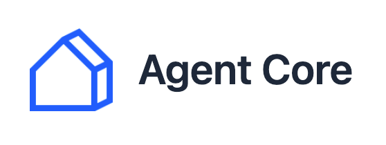

# Agent Core - Laravel Real Estate Management System

<p align="center">
  
</p>

## 📝 Project Description
**Agent Core** is an advanced Content Management System (CMS) designed for the real estate sector, built on the **Laravel 10** framework. The system allows agencies to centralize the management of properties, construction sites, leads, and social media integrations through a single, intuitive dashboard, while offering robust APIs for integration with external websites.

## 🚀 Main Features

### 🏢 Multi-Agency Management
The system is natively multi-tenant, supporting the management of various legal entities:
- **Data Segregation**: Secure and isolated access via UUIDs and a dedicated middleware (`agency.canAccess`).
- **Company Configuration**: Comprehensive management of master data, contacts, logos, and specific settings for each agency.

### 🏠 Property Management
A comprehensive module for detailed cataloging:
- **Advanced Attributes**: Management of contracts, prices, condominium fees, square footage, and structural details (rooms, bathrooms, floors).
- **Energy Efficiency**: Full support for EPC (Energy Performance Certificate) data, heating system types, and energy consumption.
- **Multimedia**: Management of image galleries and property status (furnishing, interior conditions).

### 🏗️ Construction Sites & New Builds
A dedicated module (`ConstructionSiteController`) for managing complex real estate developments:
- Separate management of the construction site from individual housing units.
- Viewing and editing of the specific units linked to each site.

### 🌐 API & Website Integrations
The system exposes API endpoints to power showcase websites ("child websites"):
- **Property Search**: Endpoints for filtered searching and retrieving single property details.
- **Lead Management**: Handling of messages from contact forms and valuation requests directly within the dashboard.

### 🔄 Automation & Import/Export
- **RealSmart Import**: Automatic synchronization via Cron Jobs and dedicated services for mass importing of properties.
- **Maintenance Tools**: Export functions and API configuration for data exchange.

## 🛠️ Technical Requirements

### Technology Stack
- **PHP**: `^8.1`
- **Framework**: `Laravel ^10.10`
- **Frontend**: Vite, Blade Templates, Tailwind CSS/App CSS
- **Database**: MySQL / MariaDB

### Main Dependencies (composer.json)
- `laravel/sanctum`: For API authentication.
- `laravel/socialite`: For social media integrations.
- `getbrevo/brevo-php`: Integration with Brevo (formerly Sendinblue) for sending transactional emails.
- `google/apiclient`: For integration with Google services.

## 📂 Routing Structure
The system organizes its features into three main areas:
1.  **Web (Auth)**: Management of login, logout, and administrator creation.
2.  **Dashboard**: Private area for managing the agency, properties, construction sites, users, and settings.
3.  **API**: Public endpoints for integration with external websites (properties, construction sites, sending messages).

---

## ⚙️ Installation
Follow these steps to set up your project in a development environment:
1. **Clone the repository:**
```bash
    git clone github.com/cybergaro/agent_core
```
2. **Install backend and frontend dependencies:**
```bash
    composer install
    npm install
    npm run build
```
3. **Setting up the environment:**
Copy the sample configuration file and generate the application security key.
```bash
    cp .env.example .env
    php artisan key:generate
```